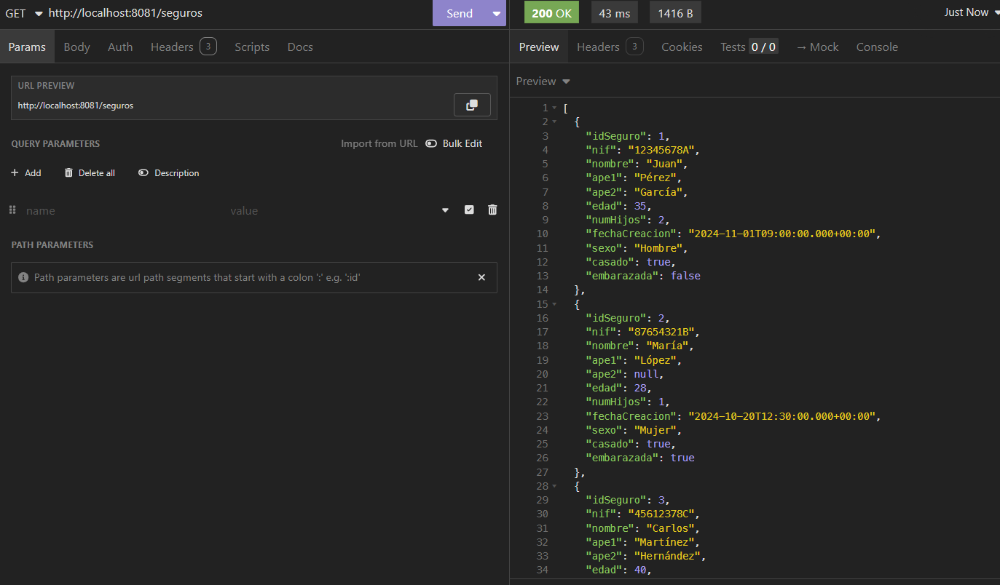

# Pruebas Insomnia

## Obtener Seguros

#### URI y Aplicación

<mark style="color:blue;">`GET`</mark> `/seguros`

#### Descripción

Obtiene todos los seguros que existen

**Respuesta**



<pre class="language-json" data-overflow="wrap" data-full-width="true"><code class="lang-json"><strong>[
</strong>	{
		"idSeguro": 1,
		"nif": "12345678A",
		"nombre": "Juan",
		"ape1": "Pérez",
		"ape2": "García",
		"edad": 35,
		"numHijos": 2,
		"fechaCreacion": "2024-11-01T09:00:00.000+00:00",
		"sexo": "Hombre",
		"casado": true,
		"embarazada": false
	},
	{
		"idSeguro": 2,
		"nif": "87654321B",
		"nombre": "María",
		"ape1": "López",
		"ape2": null,
		"edad": 28,
		"numHijos": 1,
		"fechaCreacion": "2024-10-20T12:30:00.000+00:00",
		"sexo": "Mujer",
		"casado": true,
		"embarazada": true
	}, 
	{ ... 
]
</code></pre>

Imagen Insomnia

<figure><figcaption></figcaption></figure>



***

## Obtener Seguro por ID

#### URI

<mark style="color:blue;">`GET`</mark> `/seguros/{id}`

#### Aplicación

<mark style="color:blue;">`GET`</mark> `/seguros/5`

**Respuesta**




```json
{
	"idSeguro": 5,
	"nif": "12378945E",
	"nombre": "Ana",
	"ape1": "Fernández",
	"ape2": null,
	"edad": 17,
	"numHijos": 0,
	"fechaCreacion": "2024-11-10T11:00:00.000+00:00",
	"sexo": "Mujer",
	"casado": false,
	"embarazada": false
}
```




```json
{
	"timestamp": "2024-11-11T23:04:16.534+00:00",
	"status": 500,
	"error": "Internal Server Error",
	"trace": "java.lang.Exception: El seguro con id 8 no existe\r\n\tat com.example.unsecuredseguros.controller.SeguroController.getSeguroById(SeguroController.kt:17)\r\n\tat java.base/jdk.internal.reflect.DirectMethodHandleAccessor.invoke(DirectMethodHandleAccessor.java:103)\r\n\tat java.base/java.lang.reflect.Method.invoke(Method.java:580)\r\n\tat kotlin.reflect.jvm.internal.calls.CallerImpl$Method.callMethod(CallerImpl.kt:97)\r\n\tat kotlin.reflect.jvm.internal.calls.CallerImpl$Method$Instance.call(CallerImpl.kt:113)\r\n\tat kotlin.reflect.jvm.internal.KCallableImpl.callDefaultMethod$kotlin_reflection(KCallableImpl.kt:207)\r\n\tat kotlin.reflect.jvm.internal.KCallableImpl.callBy(KCallableImpl.kt:112)\r\n\tat org.springframework.web.method.support.InvocableHandlerMethod$KotlinDelegate.invokeFunction(InvocableHandlerMethod.java:334)\r\n\tat org.springframework.web.method.support.InvocableHandlerMethod.doInvoke(InvocableHandlerMethod.java:252)\r\n\tat org.springframework.web.method.support.InvocableHandlerMethod.invokeForRequest(InvocableHandlerMethod.java:188)\r\n\tat org.springframework.web.servlet.mvc.method.annotation.ServletInvocableHandlerMethod.invokeAndHandle(ServletInvocableHandlerMethod.java:118)\r\n\tat org.springframework.web.servlet.mvc.method.annotation.RequestMappingHandlerAdapter.invokeHandlerMethod(RequestMappingHandlerAdapter.java:926)\r\n\tat org.springframework.web.servlet.mvc.method.annotation.RequestMappingHandlerAdapter.handleInternal(RequestMappingHandlerAdapter.java:831)\r\n\tat org.springframework.web.servlet.mvc.method.AbstractHandlerMethodAdapter.handle(AbstractHandlerMethodAdapter.java:87)\r\n\tat org.springframework.web.servlet.DispatcherServlet.doDispatch(DispatcherServlet.java:1089)\r\n\tat org.springframework.web.servlet.DispatcherServlet.doService(DispatcherServlet.java:979)\r\n\tat org.springframework.web.servlet.FrameworkServlet.processRequest(FrameworkServlet.java:1014)\r\n\tat org.springframework.web.servlet.FrameworkServlet.doGet(FrameworkServlet.java:903)\r\n\tat jakarta.servlet.http.HttpServlet.service(HttpServlet.java:564)\r\n\tat org.springframework.web.servlet.FrameworkServlet.service(FrameworkServlet.java:885)\r\n\tat jakarta.servlet.http.HttpServlet.service(HttpServlet.java:658)\r\n\tat org.apache.catalina.core.ApplicationFilterChain.internalDoFilter(ApplicationFilterChain.java:195)\r\n\tat org.apache.catalina.core.ApplicationFilterChain.doFilter(ApplicationFilterChain.java:140)\r\n\tat org.apache.tomcat.websocket.server.WsFilter.doFilter(WsFilter.java:51)\r\n\tat org.apache.catalina.core.ApplicationFilterChain.internalDoFilter(ApplicationFilterChain.java:164)\r\n\tat org.apache.catalina.core.ApplicationFilterChain.doFilter(ApplicationFilterChain.java:140)\r\n\tat org.springframework.web.filter.RequestContextFilter.doFilterInternal(RequestContextFilter.java:100)\r\n\tat org.springframework.web.filter.OncePerRequestFilter.doFilter(OncePerRequestFilter.java:116)\r\n\tat org.apache.catalina.core.ApplicationFilterChain.internalDoFilter(ApplicationFilterChain.java:164)\r\n\tat org.apache.catalina.core.ApplicationFilterChain.doFilter(ApplicationFilterChain.java:140)\r\n\tat org.springframework.web.filter.FormContentFilter.doFilterInternal(FormContentFilter.java:93)\r\n\tat org.springframework.web.filter.OncePerRequestFilter.doFilter(OncePerRequestFilter.java:116)\r\n\tat org.apache.catalina.core.ApplicationFilterChain.internalDoFilter(ApplicationFilterChain.java:164)\r\n\tat org.apache.catalina.core.ApplicationFilterChain.doFilter(ApplicationFilterChain.java:140)\r\n\tat org.springframework.web.filter.CharacterEncodingFilter.doFilterInternal(CharacterEncodingFilter.java:201)\r\n\tat org.springframework.web.filter.OncePerRequestFilter.doFilter(OncePerRequestFilter.java:116)\r\n\tat org.apache.catalina.core.ApplicationFilterChain.internalDoFilter(ApplicationFilterChain.java:164)\r\n\tat org.apache.catalina.core.ApplicationFilterChain.doFilter(ApplicationFilterChain.java:140)\r\n\tat org.apache.catalina.core.StandardWrapperValve.invoke(StandardWrapperValve.java:167)\r\n\tat org.apache.catalina.core.StandardContextValve.invoke(StandardContextValve.java:90)\r\n\tat org.apache.catalina.authenticator.AuthenticatorBase.invoke(AuthenticatorBase.java:483)\r\n\tat org.apache.catalina.core.StandardHostValve.invoke(StandardHostValve.java:115)\r\n\tat org.apache.catalina.valves.ErrorReportValve.invoke(ErrorReportValve.java:93)\r\n\tat org.apache.catalina.core.StandardEngineValve.invoke(StandardEngineValve.java:74)\r\n\tat org.apache.catalina.connector.CoyoteAdapter.service(CoyoteAdapter.java:344)\r\n\tat org.apache.coyote.http11.Http11Processor.service(Http11Processor.java:384)\r\n\tat org.apache.coyote.AbstractProcessorLight.process(AbstractProcessorLight.java:63)\r\n\tat org.apache.coyote.AbstractProtocol$ConnectionHandler.process(AbstractProtocol.java:905)\r\n\tat org.apache.tomcat.util.net.NioEndpoint$SocketProcessor.doRun(NioEndpoint.java:1741)\r\n\tat org.apache.tomcat.util.net.SocketProcessorBase.run(SocketProcessorBase.java:52)\r\n\tat org.apache.tomcat.util.threads.ThreadPoolExecutor.runWorker(ThreadPoolExecutor.java:1190)\r\n\tat org.apache.tomcat.util.threads.ThreadPoolExecutor$Worker.run(ThreadPoolExecutor.java:659)\r\n\tat org.apache.tomcat.util.threads.TaskThread$WrappingRunnable.run(TaskThread.java:63)\r\n\tat java.base/java.lang.Thread.run(Thread.java:1583)\r\n",
	"message": "El seguro con id 8 no existe",
	"path": "/seguros/8"
}
```





